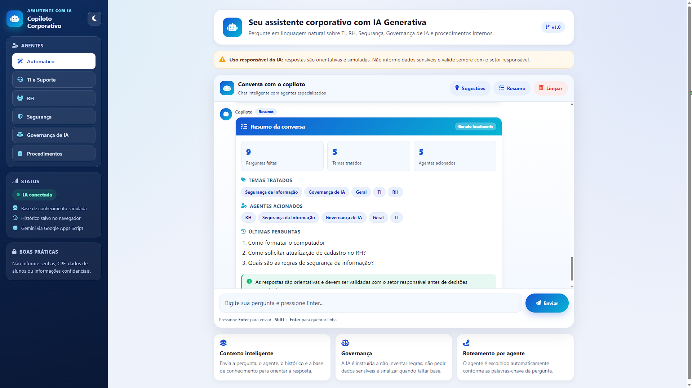
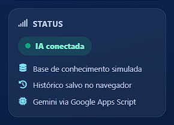
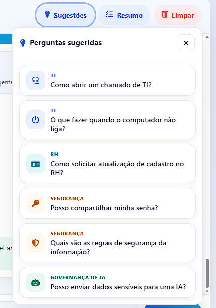
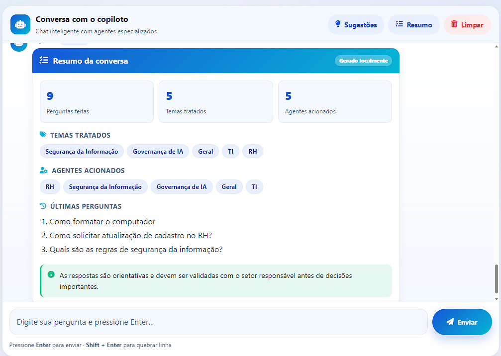
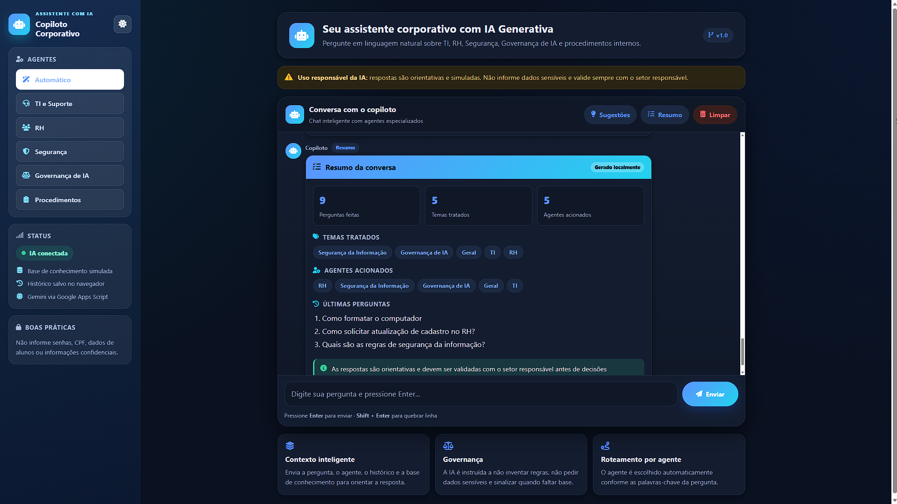
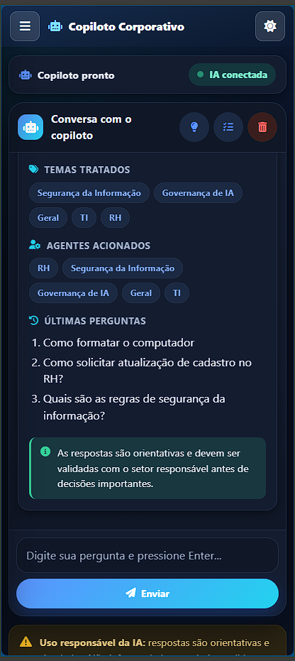

# Copiloto Corporativo Inteligente


Projeto acadêmico desenvolvido para a disciplina **IA Generativa Aplicada ao Desenvolvimento**.

---

## Descrição

O **Copiloto Corporativo Inteligente** é uma aplicação web que simula um assistente interno para colaboradores. O usuário faz perguntas em linguagem natural e recebe respostas apoiadas por IA Generativa, com base em uma base de conhecimento corporativa **simulada**.

O projeto demonstra dois usos complementares de IA Generativa: como **funcionalidade principal** da aplicação (geração das respostas do chat) e como **apoio ao desenvolvimento** do software (planejamento, código, interface e documentação).

## Demonstração

- **Link da aplicação:** em breve _(será publicado no GitHub Pages)_

## Problema proposto

Empresas concentram orientações e procedimentos em documentos espalhados entre planilhas, PDFs, apresentações, políticas e treinamentos. Isso dificulta o acesso rápido à informação, gera retrabalho e sobrecarrega áreas como TI, RH e Segurança da Informação com dúvidas recorrentes.

A proposta é oferecer um **copiloto corporativo** capaz de centralizar orientações e responder, em linguagem natural, às perguntas mais comuns dos colaboradores.

## Solução desenvolvida

Uma aplicação web de chat que:

- Recebe perguntas em linguagem natural;
- Envia a pergunta, junto com o contexto da base de conhecimento, a um backend seguro em **Google Apps Script**;
- O backend consulta a **Gemini API** (com a chave protegida no servidor) e devolve a resposta ao chat;
- Caso a IA/API esteja indisponível, a aplicação usa um **fallback local** baseado na base de conhecimento simulada;
- Reforça, na experiência de uso, boas práticas de **segurança e governança de IA**.

## Principais funcionalidades

1. Interface de chat com IA e consulta em linguagem natural.
2. Respostas reais geradas pela **Gemini API**, intermediadas pelo Google Apps Script.
3. **API Key protegida** no Apps Script via `PropertiesService` (nunca exposta no frontend).
4. **Fallback local** quando a IA/API falha, usando a base de conhecimento simulada.
5. Indicadores de **status** da aplicação:
   - IA conectada;
   - Modo demonstração;
   - Usando fallback local.
6. **Painel de sugestões** de perguntas, acionado por botão.
7. Geração de **resumo local estruturado** da conversa.
8. **Histórico** salvo no navegador com `localStorage`.
9. Botão para **limpar conversa** com confirmação.
10. **Modo claro e modo escuro**, com preferência de tema salva no navegador.
11. **Layout responsivo** para desktop, tablet e celular, com drawer/menu mobile.
12. **Acessibilidade básica**: `aria-label`, `aria-expanded`, navegação por teclado e fechamento de painel com a tecla ESC.
13. Agentes/categorias simuladas por área (TI, RH, Segurança da Informação, Governança de IA, Procedimentos Internos e Atendimento ao Colaborador).

## Tecnologias utilizadas

- **HTML5**
- **CSS3**
- **JavaScript** (puro, sem frameworks)
- **Google Apps Script** (backend intermediário / Web App)
- **Gemini API** (IA Generativa)
- **Google AI Studio** (criação e gerenciamento da API Key)
- **GitHub Pages** (hospedagem do frontend — a publicar)
- **Font Awesome Free** (ícones, via CDN)
- **localStorage** (histórico e preferências no navegador)

## Ferramentas de IA utilizadas

- **ChatGPT** — planejamento, arquitetura, elaboração de prompts, documentação e apoio à implementação.
- **Claude Code** — refinamento de código, interface, responsividade, melhorias técnicas e revisão do README.
- **Gemini API** — funcionalidade principal da aplicação, gerando as respostas reais do chat.
- **Google AI Studio** — criação e gerenciamento da chave da Gemini API.

## Arquitetura da aplicação

A chave da Gemini API **não** fica no frontend. Ela é armazenada nas Propriedades do Script do Google Apps Script (`GEMINI_API_KEY`), e o frontend chama apenas a URL pública do Web App.

```text
Usuário
  → Frontend (HTML / CSS / JavaScript)
    → Google Apps Script (Web App)        [GEMINI_API_KEY protegida no servidor]
      → Gemini API
    ← Google Apps Script
  ← Frontend
Resposta exibida no chat
```

O contexto é enviado ao backend via **prompt + base de conhecimento simulada** — o projeto não utiliza banco de dados, banco vetorial nem RAG avançado.

## Estrutura de pastas

```text
copiloto-corporativo-inteligente/
├── index.html            # Estrutura da interface
├── style.css             # Estilos, temas claro/escuro e responsividade
├── script.js             # Lógica do chat, integração e configuração (CONFIG)
├── knowledge-base.js     # Base de conhecimento simulada
├── README.md
├── appsscript/
│   └── Code.gs           # Backend em Google Apps Script (Web App)
└── docs/
    ├── PROMPTS.md
    └── PASSO_A_PASSO.md
```

## Como executar localmente

1. Baixe ou clone este repositório.
2. Abra a pasta no **VS Code**.
3. Abra o arquivo `index.html` com a extensão **Live Server** (ou diretamente no navegador).
4. **Para usar sem a Gemini** (modo demonstração): mantenha `DEMO_MODE: true` **ou** deixe `APPS_SCRIPT_URL` vazia em `CONFIG` (`script.js`). As respostas virão do fallback local.
5. **Para usar com a Gemini** (IA real): configure o Google Apps Script e a URL do Web App conforme a seção abaixo.

A configuração fica na constante `CONFIG`, no início de `script.js`:

```js
const CONFIG = {
  APPS_SCRIPT_URL: '', // URL /exec do Web App do Apps Script
  DEMO_MODE: false,    // true = força modo demonstração local
  STORAGE_KEY: 'copiloto_corporativo_historico_v1'
};
```

## Como configurar a Gemini API com Google Apps Script

1. Crie uma **API Key** da Gemini no **Google AI Studio**.
2. Crie um novo projeto no **Google Apps Script**.
3. Cole o conteúdo de `appsscript/Code.gs` no projeto.
4. Em **Configurações do projeto → Propriedades do script**, crie uma propriedade chamada `GEMINI_API_KEY` com o valor da sua chave.
5. Publique o projeto como **Web App** (implantar → nova implantação → tipo *App da Web*).
6. Copie a **URL de implantação** (terminada em `/exec`).
7. Cole essa URL em `CONFIG.APPS_SCRIPT_URL`, no `script.js`.
8. Defina `DEMO_MODE` como `false`.
9. **Nunca** coloque a API Key no frontend — ela deve permanecer apenas nas propriedades do Apps Script.

## Como publicar no GitHub Pages

1. Suba os arquivos do projeto para um repositório no GitHub.
2. No repositório, acesse **Settings → Pages**.
3. Em *Build and deployment*, selecione a branch `main` e a pasta `/root`.
4. Salve e aguarde a publicação; em seguida, acesse o link gerado pelo GitHub Pages.

## Prints da aplicação

> As imagens abaixo serão adicionadas posteriormente (placeholders).

### Tela inicial


### Chat com IA conectada


### Painel de sugestões


### Resumo da conversa


### Modo escuro


### Versão mobile


## Base de conhecimento simulada

A base de conhecimento (`knowledge-base.js`) é **simulada** e serve apenas para demonstrar o funcionamento de um copiloto corporativo. Ela **não** utiliza documentos reais nem dados sensíveis reais.

Exemplos de perguntas atendidas:

- Como abrir um chamado de TI?
- O que fazer quando o computador não liga?
- Como solicitar atualização de cadastro no RH?
- Posso compartilhar minha senha?
- Quais são as regras de segurança da informação?
- Posso enviar dados sensíveis para uma IA?

## Agentes e categorias

A aplicação simula agentes especializados por área, ajudando a organizar as respostas por contexto:

- Agente Geral;
- Agente de TI;
- Agente de RH;
- Agente de Segurança da Informação;
- Agente de Governança de IA;
- Agente de Procedimentos Internos.

## Segurança, ética e governança

O projeto reforça, tanto no código quanto na experiência de uso:

- **Não** inserir dados sensíveis ou informações pessoais na aplicação;
- **Não** compartilhar senhas;
- **Não** expor informações internas reais;
- Respostas relevantes devem ser **validadas pelo setor responsável**;
- A IA é uma **ferramenta de apoio** e não substitui a validação humana;
- A **API Key** nunca deve estar no frontend (fica protegida no Apps Script);
- Dados reais **não** devem ser utilizados em um projeto acadêmico.

## Limitações

- A base de conhecimento é **simulada** e não representa dados corporativos reais.
- A aplicação depende da disponibilidade da **Gemini API**; falhas acionam o fallback local.
- O uso gratuito da API pode ter **limites de requisição**.
- A IA pode cometer erros; respostas importantes devem ser **validadas por uma pessoa**.
- Não há banco de dados, autenticação de usuários nem persistência em servidor — o histórico fica apenas no navegador (`localStorage`).

## Próximos passos

- Permitir upload de documentos para alimentar a base de conhecimento;
- Integrar com fontes reais (por exemplo, Google Drive ou Google Sheets);
- Criar um painel administrativo para gerenciar a base de conhecimento;
- Avaliar autenticação de usuários;
- Explorar abordagens mais avançadas de contexto, como **MCP** e agentes especializados.

## Autor

**Anderson Marques**
Projeto acadêmico — disciplina *IA Generativa Aplicada ao Desenvolvimento*.

## Observação acadêmica

Este repositório corresponde à **parte prática** do trabalho. A entrega completa da disciplina também prevê uma **parte teórica** (documento sobre problema, solução, IA utilizada, agentes, automações, contexto, benefícios, limitações, ética e governança) e um **vídeo pitch** de até 4 minutos, entregues separadamente.
